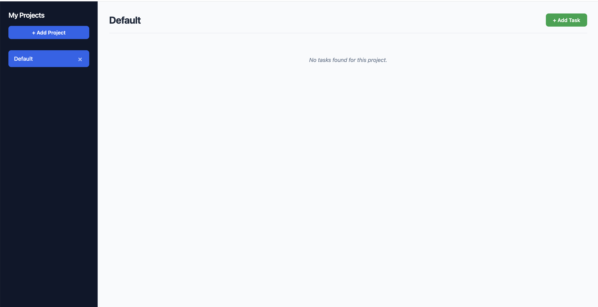

# Todo List App

A dynamic and modern project management dashboard designed to organize tasks into custom projects. The application runs entirely in the browser, featuring custom data isolation, native modal integration, and adaptive priority styling. All workspaces automatically synchronize to client-side data storage for continuous tracking across sessions.

[**Live Demo Link**](https://rudyravelindev.github.io/todo-list/)

## Features

- **Project Workspaces:** Group tasks together into modular projects to keep distinct domains separate.
- **Complete Task Management:** Assign distinct titles, descriptive notes, due dates, priority ratings, and active workflow statuses to each entry.
- **Persistent Data Storage:** Automatic background synchronization saving your projects and items state continuously.
- **Native Modals:** Form entry handled through modal layers that support immediate interface closure via keyboard shortcuts.
- **Dynamic Visual Hierarchy:** Task cards automatically alter left border colors and typography styles based on designated importance and status states.

## Technologies Used

- HTML5 (Semantic Layout & Native `<dialog>`)
- CSS3 (Custom Properties, Flexbox, CSS Grid)
- Vanilla JavaScript (ES6 Modules)
- Webpack 5 (Asset Compilation Pipeline)
- Web Storage API (`localStorage`)

## How To Use

1.  **Select active workspaces:** Click any project row inside the dark left sidebar layout to switch your main view to that project's specific task sheet.
2.  **Add Projects:** Click the **+ Add Project** button at the top of the sidebar, fill out the project title inside the modal form, and submit.
3.  **Add Tasks:** Select your target workspace row, click the **+ Add Task** button on the top right header, fill out the task attributes, and save.
4.  **Delete Tasks:** Click the custom **Delete** button situated on the right side of individual task cards to wipe them from the project list.
5.  **Remove Projects:** Tap the small **×** cross symbol positioned next to any project label inside the sidebar layout to erase the project along with all of its associated task cards.

## What I Learned

### Factory Functions vs. Constructors

I utilized Factory Functions instead of Class Constructors or prototypes to generate individual project and task instances. Factory functions allow for object generation without the syntactic complexity of `new` keywords or `this` binding ambiguities. They also naturally support clean property extraction during data formatting pipelines.

### Module Pattern with IIFEs

The engine layer leverages the Module Pattern enclosed within an Immediately Invoked Function Expression (IIFE). This pattern creates a private data scope that hides the master `projects` array from external global modification. It exposes a tightly regulated public API surface containing only necessary actions.

### Separation of Concerns

The architecture splits data management from presentation layouts across distinct module files:

- `projectManager.js` handles data creation, mutation, filtration, and storage transactions.
- `ui.js` handles DOM mutations, styling triggers, node selections, and browser interaction events.

This boundaries arrangement ensures that tweaking layout themes or updating the markup configuration doesn't break underlying calculation routines.

### LocalStorage Persistence

To protect user data across page reloads, I built serialization checkpoints that handle reading and writing custom data trees. Stringifying complex arrays before saving them and parsing them securely upon application initialization provides instant synchronization.

### Event Delegation

Instead of attaching heavy event event listeners to thousands of individual buttons, I applied event delegation to the parent layout containers (`#project-list` and `#task-list`). The bubbles phase intercepts child element click paths, references custom `data-*` metadata attributes, and routes requests safely.

## Acknowledgements

- [The Odin Project](https://theodinproject.com) Curriculum
